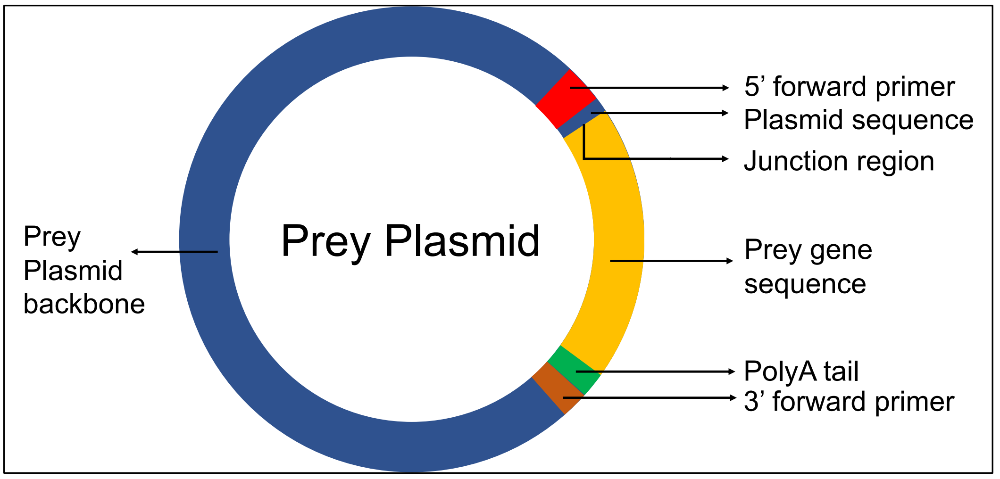
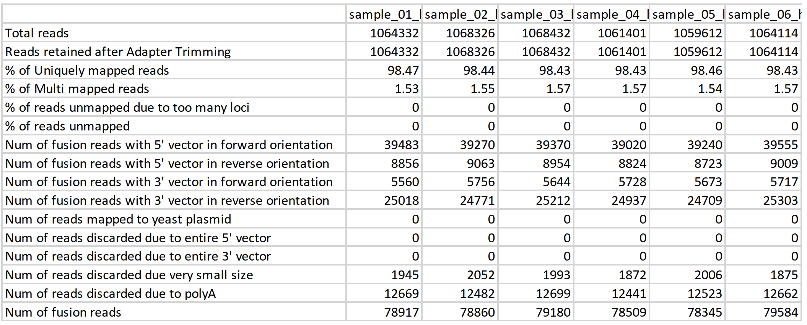
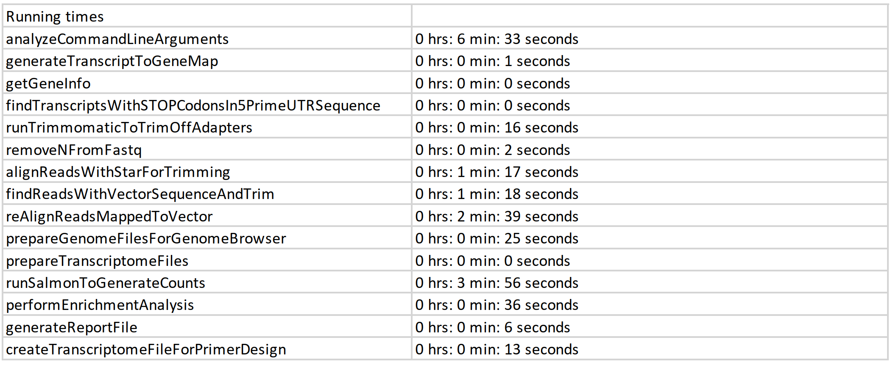
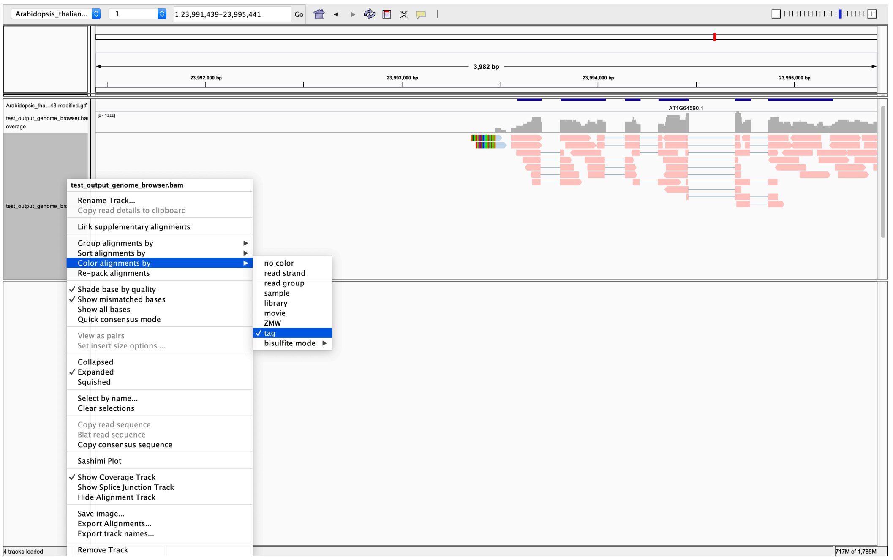

# NGPINT: A Next-generation protein-protein interaction software

## Introduction

This software manual describes how to operate NGPINT to generate a list of potential interactors. NGPINT takes one configuration file in csv format. It generates all the intermediate and final files inside the output directory. NGPINT has been published in Briefings in Bioinformatics. Please refer to the manuscript for more details about each module. The entire pipeline has been coded in Python 3. Included in the manual are explanations on how to install dependent softwares in the container environment generated by conda.

# Installing NGPINT

## Downloading NGPINT

NGPINT is released as a docker image and can be obtained from DockerHub.

```
docker pull sagnikbanerjee15/ngpint:1.0.0
```

You may create your own docker image from the `Dockerfile` locally

```bash
NGPINT_VERSION=1.0.0
wget --no-check-certificate https://github.com/sagnikbanerjee15/NGPINT/archive/refs/tags/NGPINTv${NGPINT_VERSION}.tar.gz
cd NGPINTv{NGPINT_VERSION}
docker build ngpint:${NGPINT_VERSION=1.0.0} . # Please remember to set proxies if you need to
```

# Running NGPINT

`NGPINT` requires a configuration file that tells the program where to search for the input files and also sets a number of parameters. Click here to set up the configuration file

## Running the Demonstration Package

After decompressing, the examples folder should contain the following files:

```bash
- Arabidopsis_thaliana.TAIR10.dna.toplevel.fa # Arabidopsis thaliana genome
- Arabidopsis_thaliana.TAIR10.43.modified.gtf # Arabidopsis thaliana gene annotations
- sample_01_headers_modified.fastq
- sample_02_headers_modified.fastq
- sample_03_headers_modified.fastq
- sample_04_headers_modified.fastq
- sample_05_headers_modified.fastq
- sample_06_headers_modified.fastq
- plasmids.fasta
- ../empty_input_arguments.csv
```

The demonstration folder contains the genome sequence of Arabidopsis thaliana, the genome annotations, plasmid sequences and the set of reads from selected and nonselected samples.

## Setting Up the Configuration File

Copy the empty configuration file into this folder

```bash
cp ../empty_input_arguments.csv metadata.csv
```

Open the metadata.csv in excel. You should see 20 lines where the first line is the header and the remaining lines correspond to 19 arguments. We explain each entry in detail below. Additional instructions to run the demonstration are also shown below:

* **input_ended** - Specify whether the selected (input) samples are SE (single end) or PE (paired end). The pipeline will assume SE by default. For this example, the samples are SE. You may enter SE in cell E2 or leave it blank.

* **input_fullpath** - Specify the name of the selected sample (input) fastq files along with their entire path. File MUST end in fastq e.g., `sample_01_headers_modified.fastq`. Mention all replicate files separated by semicolons ‘;’. Please do NOT use commas ‘,’ to separate the replicate files. If you have paired-end data, then place the name of the files for each pair from the same sample next to each other. For example, if you are working with 3 replicates, which are labelled as sample_selected_1, sample_selected_2 and sample_selected_3, then enter the following in cell `E3`

  ```bash
  sample_selected_1_1.fastq;sample_selected_1_2.fastq;sample_selected_2_1.fastq;
  sample_selected_2_2.fastq;sample_selected_3_1.fastq;sample_selected_3_2.fastq
  ```

  Here `sample_selected_1_1.fastq` contains the forward reads from the sample `sample_selected_1.fastq` and contains the `sample_selected_1_2.fastq` reverse reads. Please note that since we will launch the program from the demonstration directory, we do not need to provide the full path of the read files. To be safe, it is best to always provide the entire full path of the files. For this example, enter the following in cell `E3`

  ```bash
  sample_01_headers_modified.fastq;sample_02_headers_modified.fastq;sample_03_headers_m
  odified.fastq;
  ```

* **background_ended** - Specify whether the non-selected (background) samples are SE or PE. The pipeline will assume SE by default. This is just like the argument ‘input_ended’. For this example, the samples are SE. You may enter SE in cell `E4` or leave it blank.

* **background_fullpath** - Specify the names of the non-selected (background) sample files along with their entire path. This argument is similar to ‘input_fullpath’. Enter the following in cell `E5`

  ```bash
  sample_04_headers_modified.fastq;sample_05_headers_modified.fastq;sample_06_headers_m
  odified.fastq;
  ```

* **genome** - Specify the name of the genome fasta file of the organism. Please note that the program will **NOT** be able to handle multiple fasta files. If you have multiple fasta files, please concatenate them and put them in one file. If the genome is unavailable, a transcriptome fasta file can be entered. For this demonstration, please enter the following in cell `E6`

  ```bash
  Arabidopsis_thaliana.TAIR10.dna.toplevel.fa
  ```

* **star_genome_index** - Specify the directory where the STAR index of the genome is present. You may choose to leave this field blank. NGPINT will generate STAR index. If you have a large genome (above 1GB), we recommend that you create the STAR index. Here we demonstrate how to generate the index required by `NGPINT` using the provided genome in the example folder.

  ```bash
  # Decide the number of CPUs
  CPU=30
  # Create file for primers
  echo -e
  ">5_prime_end\nCGCGTTTGGAATCACTACAGGGATGTTTAATACCACTACAATGGATGATGTATATAACTATCTATTCGAT
  GATGAAGATACCCCACCAAACCCAAAAAAAGAGGGTGGGTCGAATCAAACAAGTTTGTACAAAAAAGTTGG\n>3_prime_end
  \nACCCAACTTTCTTGTACAAAGTGGTTTGATGGCCGCTAAGTAAGTAAGACGTCGAGCTCTAAGTAAGTAACGGCCGCCACCGC
  GGTGGAGCTTTGGACTTCTTCGCCAGAGGTTTGGTCAAGTCTCC" > vectors.fasta
  # Create directory for STAR index
  mkdir star_index
  # Create star directory
  STAR –-runMode genomeGenerate \
  --runThreadsN $CPU \
  --genomeDir star_index \
  -- sjdbGTFfile Arabidopsis_thaliana.TAIR10.43.modified.gtf \
  --genomeFastaFile Arabidopsis_thaliana.TAIR10.dna.toplevel.fa \
  vectors.fasta \
  plasmids.fasta
  ```

* **output_directory** - Specify an output directory to which all the generated files will be housed. This directory contains the summary file showing details of the execution and a progress.log file, which can be checked later. Please make sure that there are sufficient permissions to create the output directory. The program will throw an error if creation of the output directory fails. For this demonstration, enter `test_output` in cell `E8`.

* **plasmid_sequences** - Specify a fasta file containing two plasmid sequences - one for the bait plasmid and the other for the prey plasmid. For this demonstration, enter `plasmids.fasta` in cell `E9`. When generating your sequence remember to include only the prey plasmid backbone sequence as shown in **Fig 1**. Similarly, for the bait plasmid, include only the plasmid sequence without the bait insert.

* **five_prime_vector** - Enter the sequence of the 5-prime vector. Please note that you will have to enter the whole sequence from the 5’ primer to the junction between the plasmid and the insert (The red and the adjoining blue region shown in **Fig 1**). For this demonstration, enter `CGCGTTTGGAATCACTACAGGGATGTTTAATACCACTACAATGGATGATGTATATAACTATCTATTCGATGATGAAGATACCCCACCAAACCCAAAAAAAGAGGGTGGGTCGAATCAAACAAGTTTGTACAAAAAAGTTGG` in cell `E10`

* **three_prime_vector** - Enter the sequence of the 3 prime vector. Similar to the 5_prime_vector input, enter the entire region from the end of the polyA tail + plasmid junction to the three prime vector. For this demonstration, enter `ACCCAACTTTCTTGTACAAAGTGGTTTGATGGCCGCTAAGTAAGTAAGACGTCGAGCTCTAAGTAAGTAACGGCCGCCACCGCGGTGGAGCTTTGGACTTCTTCGCCAGAGGTTTGGTCAAGTCTCC` in cell `E11`

* **CPU** - Provide the number of CPUs to be used. Enter the number of CPUs you would like to work with in cell `E12`. The default is `1`.

* **frame_of_TF_fusion** - Enter the frame for the fusion of the transcription factor with the insert. Pipeline assumes frame 0. Possible values are 0, 1 and 2. For this demonstration, enter 2 in cell E13. A total of three peptide sequences can be generated from any nucleotide sequence by varying the frame of translation. Whole genome Y2H operates by capturing all expressed transcripts and inserting those into plasmids. Often only partial transcripts are captured making it impossible to clone the inserts in-frame. Y2H-Seq protocols allow for the creation of 3-frame libraries where the insert is frame adjusted by including nucleotides at the junction between the transcription factor (TF) and the insert. For this demonstration, the codon groups of the nucleotides of five prime vector sequence can be depicted as,

  C GCG TTT GGA ATC ACT ACA GGG ATG TTT AAT ACC ACT ACA ATG GAT GAT GTA TAT AAC TAT CTA TTC GAT GAT GAA GAT ACC CCA CCA AAC CCA AAA AAA GAG GGT GGG TCG AAT CAA ACA AGT TTG TAC AAA AAA GTT **GG**

  The last partial codon is GG (shown in bold). Since GG is 2 nucleotides, the value for this field needs to be set to 2. This value could change depending on the plasmid that is used.

* **nucleotide_for_frame_shift** - Enter the nucleotide with which 3 frame generation has been done. In our setting we used ‘A’ to generate the 3 frames. Other labs might choose a different nucleotide. The program needs to know the nucleotide to verify if the read was indeed a fusion read. For this example, enter ‘A’ in cell `E14`.

* **min_trimmed_length** - Please provide the minimum length of sequence to keep post adapter trimming and fusion read trimming. You may choose to use the default value of `15` or enter your desired value in cell `E15`

* **force** - Overwrites the output directory if it exists. Setting this flag will enforce the software to run all the steps. Enter a value of `1` in cell `E16` if you wish to overwrite the output directory and start the computation from scratch.

* **clean_up** - Set this to `1` if you wish to clean up all the intermediate files. The program is automatically set to 0, which keeps all temporary files. It is recommended to keep this setting at 0 to prevent reanalysis of the whole data in case the program fails. Enter response in cell `E17`

* **gtf_annotation** - Enter the full path of the gene-annotation file in GTF format. For this demonstration, enter `Arabidopsis_thaliana.TAIR10.43.modified.gtf` in cell `E18`

* **functional_annotation** - Enter a tab delimited file of gene(s) and their corresponding functional annotation(s). This argument will be used in future releases.

* **transcriptome_index** - Enter the location where the transcriptome index is present. You can leave this blank. `NGPINT` will generate an index.



Once you have set up the configuration file, it must be identical to the provided configuration file titled `metadata_from_developers.csv`

## Executing the program

To execute the program just run the `ngpint` file and provide the configuration file as an argument. Make sure you are inside the examples folder.

```bash
ngpint -a metadata_from_developers.csv
```

This will create the output directory named `test_output`, which will contain all the relevant files and folders.

## Processing outputs

In this section, we will describe how the output directory is organized and what each file represents.

### Understanding the Structure of the Output Directory

The output directory contains log files, alignment files and final reports. All computations are stored inside the temp directory. Users do not need to access the contents of temp.

### The Log file

`NGPINT` outputs progress information from time to time in a file titled progress.log stored under the output directory. This file will be useful to figure out issues if a run ends in failure.

### Prioritizing Interactions for Secondary Validation

A preliminary prioritization can be done by analyzing the output summarized in the file `<output_directory_name>_final_report.csv`. The file contains the p-adjusted value and the number of fusion reads recognized in-frame. These could be sorted to pull out a group of potential interactors, but users are recommended to use the companion software, [Y2H-SCORES](https://github.com/Wiselab2/Y2H-SCORES) (Velásquez-Zapata et. al., 2020), to generate a more comprehensive prioritization of preys.

### The File With Run Details

Details about execution of each module can be found in `<output_directory_name>_run_details.csv`. The file lists details about the number of reads mapped, number of fusion reads, etc. for each sample. A snapshot has been provided here.




The `run_details` file also reports the location of the alignment files which is necessary to view the coverage. Finally, it lists the execution time for each module of `NGPINT`.



## Viewing Data on Genome Viewers

Separate alignment files are reported for each replicate and one bam file is generated by combining the alignments from all the replicates. The location of the alignment files for each replicate is listed in row 18 of the run_details file and line 19 contains the location of the alignment file with all replicates merged.

### Configuring IGV to View Fusion Reads

Fusion read alignments are altered such that the vector portion of such reads appear as soft-clipped when viewed in the latest version of Integrated Genome Viewer (IGV). Load the alignments from the merged replicate alignment file. To view fusion reads, right click on the panel and choose `tag` from `Color alignments by`. Enter ‘FR’ in the field as demonstrated in **Fig 4**. This will represent the fusion reads in a different color.



## Citation

If you use `NGPINT`, please cite the following papers 

1. Banerjee S, Velásquez-Zapata V, Fuerst, G, Elmore JM, Wise RP. 2020. [NGPINT: A Next-generation protein-protein interaction software. Briefings in Bioinformatics](https://academic.oup.com/bib/advance-article/doi/10.1093/bib/bbaa351/6046042?login=true)
2. Velásquez-Zapata V, Elmore JM, Banerjee S, Dorman KS, Wise RP. 2020. [Y2H-SCORES: A statistical framework to infer protein-protein interactions from next-generation yeast-two-hybrid sequence data. PLOS Computational Biology (submitted)](https://www.biorxiv.org/content/10.1101/2020.09.08.288365v2)

## License

MIT License

Copyright (c) 2020 rpwise

Permission is hereby granted, free of charge, to any person obtaining a copy
of this software and associated documentation files (the "Software"), to deal
in the Software without restriction, including without limitation the rights
to use, copy, modify, merge, publish, distribute, sublicense, and/or sell
copies of the Software, and to permit persons to whom the Software is
furnished to do so, subject to the following conditions:

The above copyright notice and this permission notice shall be included in all
copies or substantial portions of the Software.

THE SOFTWARE IS PROVIDED "AS IS", WITHOUT WARRANTY OF ANY KIND, EXPRESS OR
IMPLIED, INCLUDING BUT NOT LIMITED TO THE WARRANTIES OF MERCHANTABILITY,
FITNESS FOR A PARTICULAR PURPOSE AND NONINFRINGEMENT. IN NO EVENT SHALL THE
AUTHORS OR COPYRIGHT HOLDERS BE LIABLE FOR ANY CLAIM, DAMAGES OR OTHER
LIABILITY, WHETHER IN AN ACTION OF CONTRACT, TORT OR OTHERWISE, ARISING FROM,
OUT OF OR IN CONNECTION WITH THE SOFTWARE OR THE USE OR OTHER DEALINGS IN THE
SOFTWARE.

## Manual

Please access the manual from the GitHub folder

## Contacting Us

Correspondence regarding the papers should be addressed to Roger.Wise@usda.gov. Please post bugs and issues regarding the NGPINT software at https://github.com/Wiselab2/NGPINT/issues.

